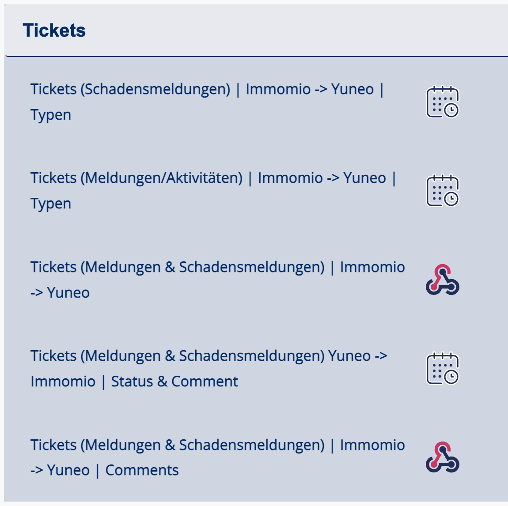

# Immomio

## Übersicht

* **Kategorien**: [Interessentenmanagement](../kategorien/interessentenmanagement.md), [Mieterkommunikation](../kategorien/mieterkommunikation.md)
* **Use Cases**: [Stammdaten](immomio.md#stammdaten), [Interessenten](../kategorien/interessentenmanagement.md)
* **Marketplace**: [Immomio](https://marketplace.aareon.com/de/listings/immomio)

## Beschreibung

Immomio - Die 360° Plattform für die Wohnungswirtschaft. Von der Neubauprojekt-Vermarktung, über die Bestandsvermietung, den digitalen Mietvertrag bis zur Mieterapp. Mit den digitalen Lösungen von Immomio verbinden Sie alle Prozesse rund um Ihre Wohnungen und Mieter. Bei weiteren Fragen zur Anbindung melden Sie sich direkt bei Immomio.

## Mit Immomio verbinden


HINWEIS: Für eine Integration wird zum sauberen Testen eine **Sandbox von Immomio benötigt**. Bitte wenden Sie sich mit **ausreichend Vorlauf** an Ihren Account Manager, damit diese beantragt und eingerichtet werden kann und dieser Vorgang den Integrations-Zeitplan nicht verzögert.


1. Um einen Immomio-Use-Case zu nutzen benötigen Sie zur Aktivierung die **Immomio API Zugangsdaten**. Diese finden Sie folgendermaßen:
   1. Klicken Sie auf der **Task-Leiste** zur linken auf das **Steuerrad**
   2. Klicken Sie dort auf **Konfiguration**
   3. Daraufhin wird sich eine Seite öffnen, wo oben **API Benutzer** steht. Hier können neue API Zugangsdaten erstellt oder existierende abgerufen werden. Speichern Sie sich ihren **API Benutzername** und das **Passwort** ab. Diese werden für die Aktivierung im ERP benötigt.

<figure><figcaption></figcaption></figure>

2. Nachdem Sie Aareon Connect Kunde geworden sind, können Sie die verfügbaren **Immomio Integrationen innerhalb Ihres ERP-Systems** auswählen und aktivieren. Mehr Details dazu finden Sie hier[^1].

### **Sonderfall: DIT System**

Sollte Ihr Immomio Account über ein altes DIT System laufen, werden sie zusätzlich FTP Zugangsdaten bereitstellen müssen. Diese sind innerhalb von Immomio folgendermaßen zu finden:

1. &#x20;Klicken Sie auf der **Task-Leiste** zur linken auf das **Steuerrad**
2. Klicken Sie dort auf **Bestandsimport**
3. Hier können die benötigten Zugangsdaten abgerufen werden:

<figure><figcaption></figcaption></figure>

## Use Cases

### 1. Stammdaten

#### Übersicht

* [Allgemeine Informationen](../use-cases/allgemein/stammdaten.md)
* [Feld Mapping](https://docs.google.com/spreadsheets/d/1fLwCGcttemtlDpznO3O00352cZZ5SPJXBPv6IRWQ6Bk/edit?gid=1022321755#gid=1022321755)

#### Entitäten

<table><thead><tr><th width="374">ERP</th><th>Immomio</th></tr></thead><tbody><tr><td>Mandanten</td><td>Wirtschaftseinheiten</td></tr><tr><td><a href="../entitaeten/wirtschaftseinheiten.md">Wirtschaftseinheiten</a></td><td>Wirtschaftseinheiten</td></tr><tr><td><a href="../entitaeten/gebaeude.md">Gebäude</a></td><td>Wirtschaftseinheiten (bei Immotion nicht enthalten)</td></tr><tr><td><a href="../kategorien/eigentuemerverwaltung.md">Verwaltungseinheiten</a></td><td>Wirtschaftseinheiten</td></tr><tr><td><a href="../entitaeten/mietvertraege.md">Mietverträge</a></td><td>Mietverträge</td></tr><tr><td><a href="../entitaeten/mieter.md">Mieter</a></td><td>Mieter</td></tr></tbody></table>

#### Einstellungen

<table><thead><tr><th width="328.3333333333333">Name</th><th>Beschreibung</th><th>Optionen</th></tr></thead><tbody><tr><td>Separator für zusammengesetzte IDs (nicht bei Immotion)</td><td>Dieser Separator zwischen der Nummer der Mandanten, Wirtschaftseinheinten, Gebäuden und Einheiten und wird in Immomio als ID angezeigt. Bei GAP Immotion ist der Separator immer ein <code>.</code>.</td><td><code>.</code>, <code>/</code></td></tr><tr><td>Mandanten Nummern</td><td>Es werden nur Daten für die eingetragenen Mandanten synchronisiert.</td><td></td></tr><tr><td>ERP-Nutzungsarten für Einheiten in Immomio</td><td>Es werden die Verwaltungseinheiten als Einheiten nach Immomio übertragen, die in Immotion folgende Nutzungsarten haben. Dieser wird aus dem Katalog im ERP entnommen.</td><td>Bspw. <code>"Wohnraum", "Wohnen"</code></td></tr><tr><td>ERP-Nutzungsarten für Garagen in Immomio</td><td>Es werden die Verwaltungseinheiten als Garagen nach Immomio übertragen, die in Immotion folgende Nutzungsarten haben. Dieser wird aus dem Katalog im ERP entnommen. </td><td>Bspw. <code>"Stellplatz", "Garage"</code></td></tr><tr><td>ERP-Nutzungsarten für Gewerbeeinheiten in Immomio</td><td>Es werden die Verwaltungseinheiten als Gewerbeeinheiten nach Immomio übertragen, die in Immotion folgende Nutzungsarten haben. Dieser wird aus dem Katalog im ERP entnommen. </td><td>Bspw. <code>"Gewerbe", "Gewerbeeinheit"</code></td></tr></tbody></table>

#### Voraussetzungen

1. Es werden nur Mieter mit einer hinterlegten E-Mail Adresse synchronisiert, weil keine User erstellt werden können.
2. Wir brauchen einen ERP User der "IMMOMIO" genannt wird, über den die Integration läuft.

### 2. Leerstände & Interessenten

#### Übersicht

* [Allgemeine Informationen Leerstände](../entitaeten/leerstaende.md)
* [Allgemeine Informationen Interessenten](../use-cases/crm/interessenten.md)
* [Feld Mapping](https://docs.google.com/spreadsheets/d/1fLwCGcttemtlDpznO3O00352cZZ5SPJXBPv6IRWQ6Bk/edit?gid=1046693259#gid=1046693259)

| ERP                                           | Immomio              |
| --------------------------------------------- | -------------------- |
| [Leerstand](../entitaeten/leerstaende.md)     | Leerstand            |
| [Interessent](../entitaeten/interessenten.md) | Interessent / Mieter |

#### Einstellungen

| Name                                                    | Beschreibung                                                                                                                                                                              | Optionen |
| ------------------------------------------------------- | ----------------------------------------------------------------------------------------------------------------------------------------------------------------------------------------- | -------- |
| Separator für zusammengesetzte IDs (nicht bei Immotion) | Dieser Separator zwischen der Nummer der Mandanten, Wirtschaftseinheinten, Gebäuden und Einheiten und wird in Immomio als ID angezeigt. Bei GAP Immotion ist der Separator immer ein `.`. | `.`, `/` |

#### Voraussetzungen

* Die Leerstände müssen mit einer Nettokaltmiete übertragen werden
* Nur Wodis: Die Leerstands-ID in Immomio muss immer viergliedrig sein: Mandanten, Wirtschaftseinheiten, Gebäude und Verwaltungseinheiten, bspw. `1.2.3.4`.&#x20;
* Nur Immotion: die Leerstands-ID in Immomio wird immer dreigliedrig übertragen: Mandanten, Wirtschaftseinheiten, Verwaltungseinheiten, bspw. `1.2.4`.&#x20;

**FAQ**&#x20;

**Werden alle Mieter als Geschäftspartner zu Sigma übertragen?**

Nein, es wird nur der Hauptmieter als Geschäftspartner zu Sigma übertragen.

#### Test der Integration: Leerstand von ERP nach Immomio

Nachdem Sie die Integration aktiviert haben und die ersten Leerstände in Ihrem Immomio Account zusehen sind, prüfen Sie bitte, ob alle Daten wie gewünscht übertragen wurden. Eine Checkliste dazu finden Sie hier:

* Wurden die Einheitstypen richtig überspielt?
  * Gewerbe, Wohnen, Parkplatz
* Ist die Anzahl der Leerstände korrekt übertragen worden?
* Sind die Felder richtig angekommen
  * Adresse
  * Details
    * Objekt ID
    * Anzahl Räume
    * Etage
    * Baujahr
    * Verfügbarkeitsdatum
    * Fehlen welche?
* Kosten:&#x20;
  * Grundmiete
  * Gesamtmiete
  * Heizkosten
  * Betriebskosten
* Ist die Ausstattung korrekt übertragen:&#x20;
  * Keller
  * Einbauküche
  * Gegensprechanlage
  * Aufzug
  * Fahrradraum
  * Gäste WC
  * Fehlen welche?
* Energieeffizienz
  * Zentral Heizung
  * Fehlen welche?

#### Test der Integration: Mieter aus Immomio nach ERP

Mieter in Immomio anlegen zum prüfen:

1. Interessenten aufnehmen:&#x20;
   1. Bei importierten Objekten auf 3 Punkte und dann “Objekt Link kopieren” und in privates Fenster kopieren
   2. Interessenteninfos ausfüllen, um einen anzulegen
   3. Resultat: Objekt hat einen Interessenten. Dies ist an (+1) zu erkennen.
2. Objekt nach Offline verschieben
   1. Objekt bearbeiten und immer next (mindestens Pflichtfelder ausfüllen, die mit \* markiert sind)
   2. Resultat: Objekt springt nach “offline” und hat einen Interessenten
3. Interessenten zu Mieter machen
   1. Objekt in “offline” Reiter suchen
   2. Auf Interessenten clicken, um anzeigen zu lassen
   3. “Als Mieter akzeptieren” clicken
   4. Resultat: Der Mieter wird nun von der Integration synchronisiert

#### Voraussetzungen

1. Die Leerstände müssen mit einer Nettokaltmiete übertragen werden

### 3. Tickets / Aktivitäten und Schadensmeldungen

#### Übersicht

* [Allgemeine Informationen Aktivitäten und Schadensmeldungen](../use-cases/crm/tickets.md)
* In Immomio erstellte **Anliegen** werden **immer** als **Aktivität** ins ERP übertragen.
* In Immomio erstellte **Schäden** erzeugen **immer** eine **Aktivität** und **optional** zusätzlich eine **Schadensmeldung**, die mit der Aktivität verknüpft ist (Empfehlung: Aktivitätstyp **„Schadensmeldung Immomio“** im ERP anlegen).
* **Rückmeldungen aus dem ERP:** Wird eine Aktivität im ERP bearbeitet (Statusänderung oder Kommentar), erscheint dies in **Immomio** nach spätestens 15 min.
* **Anhänge** eines **Anliegens** aus Immomio können auch übertragen werden. Hierzu müssen Sie in Yuneo ein Archiv mit den Aktivitäten verknüpfen. Wir empfehlen ein Archiv "Immomio Anhänge" anzulegen.
* **Synchronisation:**
  * **Immomio → Yuneo/ERP:** Anliegen, Schäden und **Kommentare** nahezu **live**.
  * **Yuneo/ERP → Immomio:** **Kommentare** und **Statusupdates** alle **15 Minuten**.

#### Voraussetzungen und ERP Einstellungen

1. **Archive für Anhänge an Aktivitäten**\
   Anhänge zu Schäden und Anliegen werden im ERP in einem Archiv abgelegt und anschließend mit dem zugehörigen Mietvertrag oder Mitglied verknüpft. Hierzu müssen Sie im Bereich Archive:
   1. jeweils ein Archiv erstellen: 'MV Mieterapp' und 'MI Mieterapp',
   2. das Stammdatum mit 'Mietvertrag' und 'Mitglied' vorbelegen\
      .png>)
   3. und den Hauptindex 'Mietvertrags-Nr.' sowie 'Mitglieds-Nr.' festlegen.\
      .png>)
2. **Aktivitätstyp für Schadensmeldung anlegen**\
   Erstellen Sie einen Aktiviätstyp mit dem Namen "Schadensmeldung Immomio" und geben Sie Ihrem Ansprechpartner bei Immomio Bescheid.

**Aktivierung**

Um die Integration zu testen wird Ihnen ein Aareon Mitarbeiter einen Link zur Verfügung stellen, über den Sie gemeinsam die Integration aktivieren werden. Sobald alles funktioniert wird die live Integration aus Ihrem Yuneo Account heraus aktiviert. So können Sie 24/7 Anpassungen vornehmen. Bitte aktivieren Sie die folgenden 5 Komponenten der Integration, indem sie den Beschreibungen folgen:

<figure><figcaption></figcaption></figure>

### 4. Dokumente

**Übersicht**

* [Allgemeine Informationen Dokumente](../use-cases/digitales-buro/dokumente.md)

Wichtige Dokumente wie Mietverträge, Betriebskostenabrechnungen oder Mietbescheinigungen können nahtlos zwischen den Plattformen synchronisiert werden. Dafür werden die gewünschten Archive mit Immomio verbunden, sodass Dokumente automatisch übertragen und für Mieter zugänglich gemacht werden.

Sobald ein Archiv mit Immomio verknüpft ist, werden alle darin gespeicherten Dokumente automatisch synchronisiert. Beispielsweise können Sie das Archiv "MI Mietvertrag" anbinden, um sicherzustellen, dass alle Mietverträge ohne manuellen Aufwand für den jeweiligen Mieter abrufbar sind.

Diese Integration wird oft in Kombination mit [Tickets](immomio.md#id-3.-tickets-aktivitaten-und-schadensmeldungen) genutzt. Diverse Ticketkategorien lösen Prozesse aus woraufhin Dokumente mit dem Mieter geteilt werden sollen. Damit diese angefragten Dokumente automatisch nach Immomio gesendet werden, müssen die entsprechenden Archive angebunden werden.

#### Einstellungen

| Name                                  | Beschreibung                                                                                                                             | Optionen                 |
| ------------------------------------- | ---------------------------------------------------------------------------------------------------------------------------------------- | ------------------------ |
| Archive die angebunden werden sollens | Welche Archive sollen angebunden werden                                                                                                  | `Archivnamen`            |
| Suchkategorien                        | Welche Suchkategorien sind relevant                                                                                                      | `Suchkategorien`         |
| Separator für zusammengesetzte IDs    | Dieser Separator zwischen der Nummer der Mandanten, Wirtschaftseinheinten, Gebäuden und Einheiten und wird in Immomio als ID angezeigt.  | `-`, `_`, `.`, `/`, `\|` |

#### Voraussetzungen

1. Das gewünschte Archiv muss mit dem **Mietvertrag verknüpft** sein (Mietvertragsnummerindex), damit die Dokumente zugeordnet werden können. Achtung: Es werden alle Dokumente eines Archives übertragen, sodass Sie vorher prüfen sollten, ob alle enthaltenen Dokumente vom Mieter gesehen werden sollen.

[^1]: (Link zu ERP overview)
